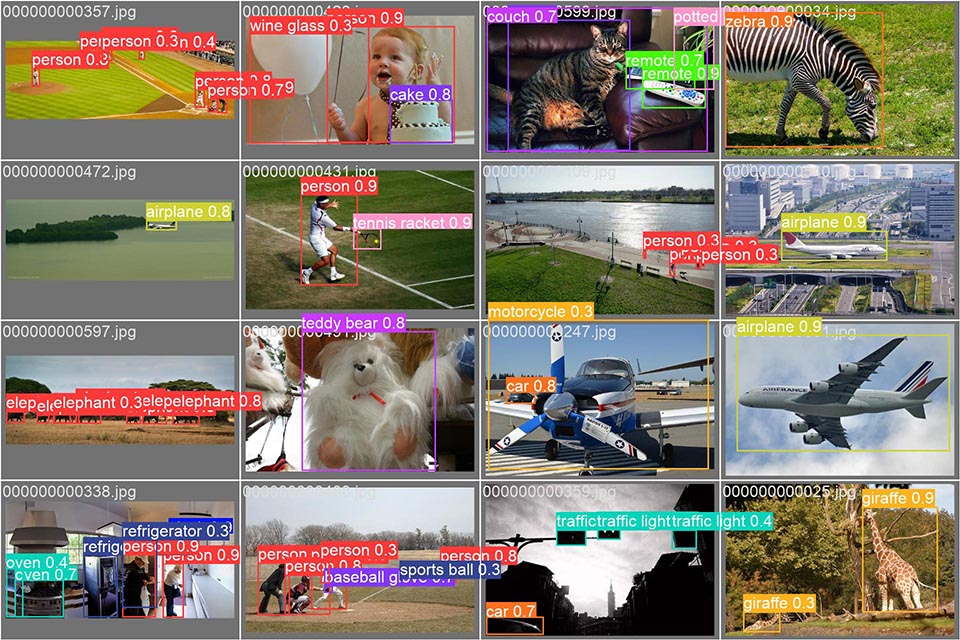
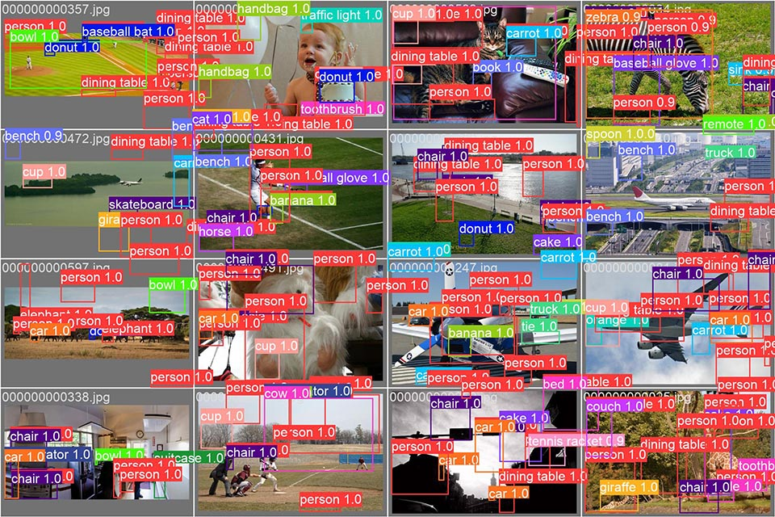

# Object detection model inject

MRFI can directly inject errors into a object detection model. We use [Ultralytics YOLOv8](https://docs.ultralytics.com/modes/val/) as an example.

YOLOv8n official model has 168 layers with complex structure.
We test it on coco128 dataset with `default_fi.yaml` configuration.

```python
# Validate fault injection to yolov8 by one line config
# Following yolov8's official docs https://docs.ultralytics.com/modes/val/
from ultralytics import YOLO
from mrfi import MRFI, EasyConfig

# Load a model
model = YOLO('experiments/yolov8n.pt')  # load an official model
# YOLO.model is true PyTorch model, so provide model.model to MRFI here
fi_model = MRFI(model.model, EasyConfig.load_file('easyconfigs/default_fi.yaml')) 
# fi_model.save_config('detailconfigs/yolov8n_dt.yaml') # save detail config

# Validate the model using YOLO's function.
metrics = model.val(data='coco128.yaml') # 128 images
print('mAP0.5:', metrics.box.map50) # got 0.03~0.05

with fi_model.golden_run():
    metrics = model.val(data='coco128.yaml')
    print('mAP0.5:', metrics.box.map50) # got 0.60
```

The mAP0.5 metric drop to 0.035 from 0.605.

Golden run prediction:


Fault inject prediction:

